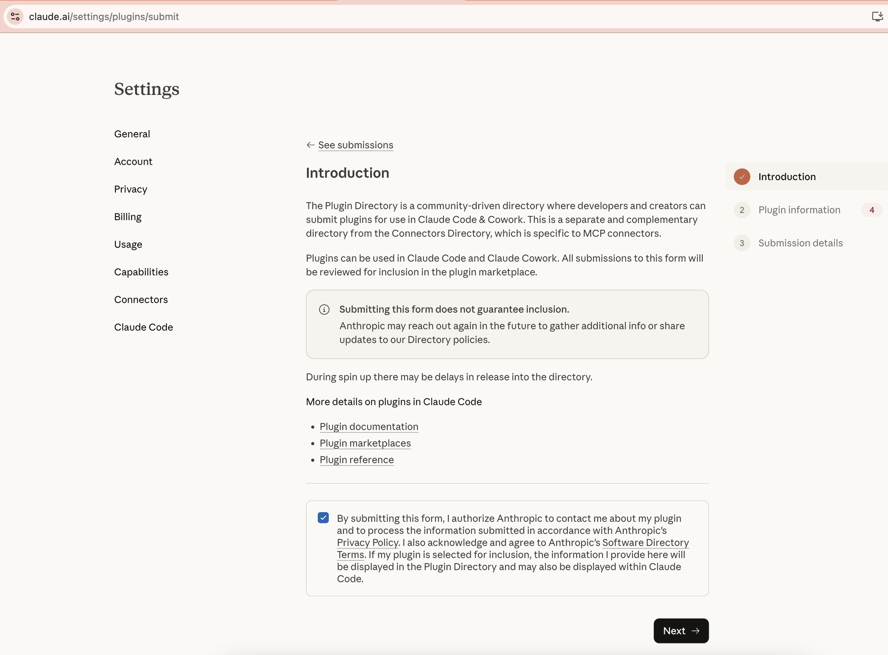
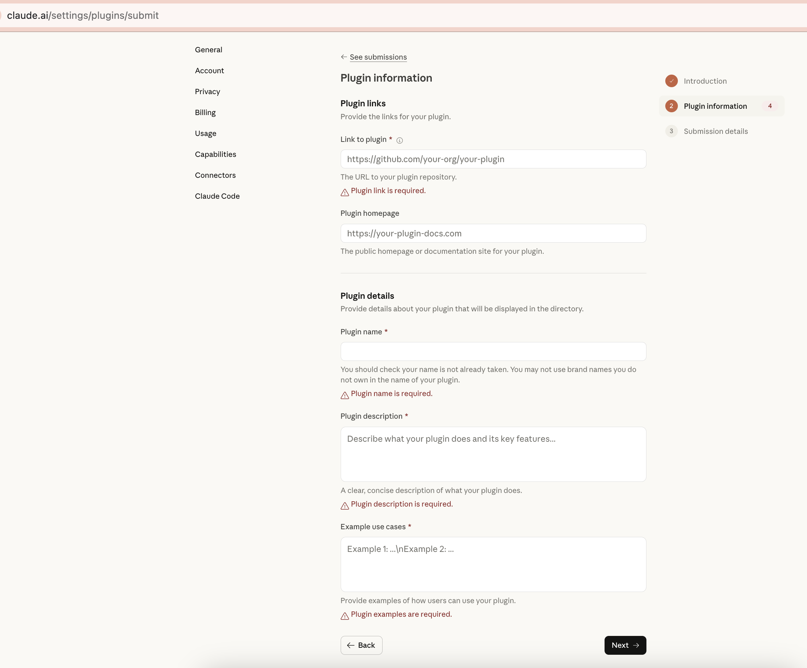
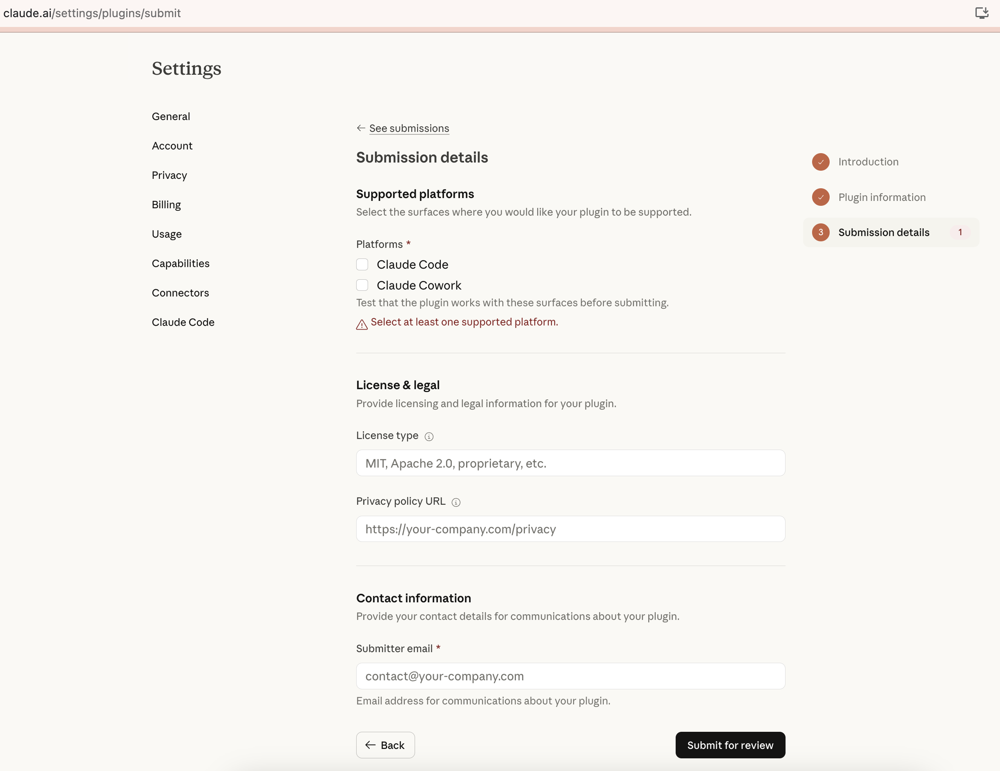
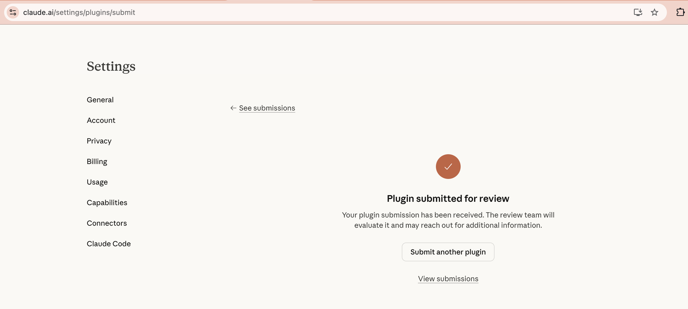

# Building a Claude Plugin from Scratch: A Step-by-Step Guide

You've heard about Claude plugins — bundles of commands, skills, and tool connections that turn Claude into a domain-specific assistant. Maybe you've read about [how the extensibility architecture works](https://github.com/gpsandhu23/blogs/blob/main/Claude_extensiblity.md). But how do you actually *build* one?

This post walks through the entire process — from idea to submission — using a real plugin I built: **daily-productivity**. It aggregates Gmail, Slack, Google Calendar, and issue trackers into a set of daily rituals: morning briefings, email triage, Slack catch-up, calendar management, and end-of-day reviews. By the end, you'll have a complete mental model for building your own plugin and submitting it to the Plugin Directory.

**What you'll learn:**
- How to structure a plugin (directories, manifest, MCP config)
- How to write commands (explicit workflows users invoke)
- How to write skills (knowledge Claude applies automatically)
- Key design patterns: standalone/supercharged, graceful degradation, draft-never-send
- How to test locally and submit to the Plugin Directory

Let's build it.

---

## What Is a Plugin?

A plugin is a directory with a specific structure that teaches Claude how to do something. No SDKs, no build steps — just markdown and JSON. Here's the anatomy:

```
plugin-name/
├── .claude-plugin/
│   └── plugin.json        # Manifest: name, version, description
├── .mcp.json               # Tool connections (Gmail, Slack, etc.)
├── CONNECTORS.md           # Documents which tools the plugin uses
├── commands/               # Slash commands users invoke explicitly
├── skills/                 # Domain knowledge Claude draws on automatically
└── README.md               # Documentation
```

**Commands** are explicit — the user types `/morning-briefing` and Claude follows a defined workflow. **Skills** are implicit — Claude reads the skill's description, recognizes when the user's request matches, and applies the skill's instructions without the user ever knowing it exists.

For a deeper dive into the three-layer architecture (MCP, Skills, Plugins) and how they fit together, see [The Extensible AI](extensibility-blog.md). This post is the hands-on companion — less architecture, more "here's what to type."

---

## Step 1: Define the Problem

Every good plugin starts with a workflow gap. Mine was this: **daily work rituals are scattered across too many tools.**

Every morning I'd open Gmail, scan for urgent emails, switch to Slack, check mentions, open Google Calendar, look at today's meetings, check Linear for assigned issues, and try to mentally prioritize all of it. The same fragmentation happened at end-of-day — what did I actually accomplish? What's still hanging?

The daily-productivity plugin wraps all of this into five commands that map to natural daily rituals:

| When | Command | What It Does |
|------|---------|-------------|
| Start of day | `/morning-briefing` | Aggregated priority view across all tools |
| Morning | `/email-triage` | Categorize inbox, draft replies |
| After lunch | `/slack-catchup` | Catch up on mentions and DMs |
| Before meetings | `/calendar prep <meeting>` | Cross-tool meeting prep |
| End of day | `/end-of-day` | Recap, loose ends, tomorrow's plan |

**Commands vs. skills decision:** I chose commands for the five daily rituals because they're explicit actions at specific times of day. But I also added skills for things that should happen *automatically* — like when someone casually asks "anything urgent in my email?" without running a full triage. More on skills in Step 7.

---

## Step 2: Create the Directory Structure

```bash
mkdir -p daily-productivity/.claude-plugin
mkdir -p daily-productivity/commands
mkdir -p daily-productivity/skills/email-prioritization
touch daily-productivity/.mcp.json
touch daily-productivity/CONNECTORS.md
touch daily-productivity/README.md
```

That gives you:

```
daily-productivity/
├── .claude-plugin/          # Plugin metadata
├── .mcp.json                # MCP server connections
├── CONNECTORS.md            # Connector documentation
├── commands/                # Slash commands
├── skills/                  # Auto-triggered skills
│   └── email-prioritization/
└── README.md
```

Each directory has a purpose:
- **`.claude-plugin/`** — Contains `plugin.json`, the manifest that identifies this as a plugin
- **`commands/`** — Each `.md` file becomes a slash command (filename = command name)
- **`skills/`** — Each subdirectory with a `SKILL.md` becomes an auto-triggered skill
- **`.mcp.json`** — Declares which external tools (MCP servers) this plugin needs
- **`CONNECTORS.md`** — Documents the connector model for anyone reading the plugin

---

## Step 3: Write the Manifest

Create `.claude-plugin/plugin.json`:

```json
{
  "name": "daily-productivity",
  "version": "1.0.0",
  "description": "Cross-tool daily workflow rituals — morning briefings, email triage, Slack catch-up, calendar management, and end-of-day reviews. Aggregates Gmail, Slack, Google Calendar, and issue trackers into a cohesive daily rhythm. Complements the productivity plugin (task/memory management) and the Slack plugin (channel-centric operations).",
  "author": {
    "name": "Anthropic"
  }
}
```

**Field breakdown:**

| Field | Purpose |
|-------|---------|
| `name` | The plugin identifier. Used for namespacing — commands become `/daily-productivity:morning-briefing` when installed alongside other plugins |
| `version` | Semver. Bump when you update |
| `description` | Shows in the Plugin Directory and helps users decide whether to install. Be specific about what the plugin does and what tools it uses |
| `author.name` | Who built it |

The description matters more than you'd think. It's what users see when browsing the directory, and it's what Claude reads to understand the plugin's scope. Be concrete — "cross-tool daily workflow rituals" tells Claude and users exactly what this plugin is for. I also called out what it complements (the productivity plugin for task management, the Slack plugin for channel-centric operations) to help users understand how it fits in the ecosystem.

---

## Step 4: Configure MCP Servers

The `.mcp.json` file declares which external tools your plugin connects to:

```json
{
  "mcpServers": {
    "gmail": {
      "type": "http",
      "url": "https://gmail.mcp.claude.com/mcp"
    },
    "slack": {
      "type": "http",
      "url": "https://mcp.slack.com/mcp"
    },
    "google-calendar": {
      "type": "http",
      "url": "https://gcal.mcp.claude.com/mcp"
    },
    "linear": {
      "type": "http",
      "url": "https://mcp.linear.app/mcp"
    },
    "atlassian": {
      "type": "http",
      "url": "https://mcp.atlassian.com/v1/mcp"
    }
  }
}
```

Five MCP servers — one for each tool category the plugin needs. When a user installs the plugin and enables it, these connections activate automatically. The user authenticates once with each service, and then Claude can invoke their tools.

### The Connector Model

Here's a key design decision: **plugins should be tool-agnostic.** Not everyone uses Gmail — some organizations use Microsoft 365. Not everyone uses Slack — some use Teams.

Rather than hardcoding tool names throughout commands, I use category placeholders like `~~email`, `~~chat`, `~~calendar`, and `~~issue tracker`. The `.mcp.json` pre-configures specific servers (Gmail, Slack, etc.), but the commands themselves reference categories. If someone swaps Gmail for Microsoft 365, they change one line in `.mcp.json` and everything still works.

Document this in `CONNECTORS.md`:

```markdown
# Connectors

## How tool references work

Plugin files use `~~category` as a placeholder for whatever tool the user
connects in that category. For example, `~~email` might mean Gmail,
Microsoft 365, or any other email provider with an MCP server.

Plugins are **tool-agnostic** — they describe workflows in terms of
categories (email, chat, calendar, etc.) rather than specific products.
The `.mcp.json` pre-configures specific MCP servers, but any MCP server
in that category works.

## Connectors for this plugin

| Category | Placeholder | Included servers | Other options |
|----------|-------------|-----------------|---------------|
| Email | `~~email` | Gmail | Microsoft 365 |
| Chat | `~~chat` | Slack | Microsoft Teams |
| Calendar | `~~calendar` | Google Calendar | Microsoft 365 |
| Issue tracker | `~~issue tracker` | Linear, Atlassian (Jira/Confluence) | Asana, Monday, ClickUp |
```

I also documented cross-plugin relationships — this plugin reads `TASKS.md` from the productivity plugin for context, but never modifies it without explicit user confirmation:

```markdown
## Cross-plugin relationship

This plugin reads `TASKS.md` from the **productivity** plugin to provide
context in morning briefings, end-of-day reviews, and action item tracking.
It **never creates or modifies** `TASKS.md` without explicit user
confirmation — the productivity plugin owns that file.

When offering to add discovered action items to `TASKS.md`, always:
1. Show the user exactly what will be added
2. Wait for confirmation before writing
3. Follow the format conventions defined in the productivity plugin's
   task-management skill
```

This boundary matters. When multiple plugins coexist, being explicit about ownership prevents surprises.

---

## Step 5: Write Your First Command

Let's build the most complex command first — `morning-briefing.md`. Every other command follows the same patterns, so understanding this one teaches you the design language.

Create `commands/morning-briefing.md`:

### Frontmatter

```yaml
---
description: Aggregated morning view — email, Slack, calendar, issues, and tasks prioritized into one briefing
argument-hint: "[--quick | --full]"
---
```

The frontmatter tells Claude what this command does (`description`) and what arguments it accepts (`argument-hint`). The description appears in the slash-command menu when users browse available commands.

### The Standalone/Supercharged Box

Every command in this plugin starts with an ASCII box that explains how it works with and without tool connections:

```
┌─────────────────────────────────────────────────────────────────┐
│                    MORNING BRIEFING                              │
├─────────────────────────────────────────────────────────────────┤
│  STANDALONE (always works)                                       │
│  ✓ You describe: today's meetings, priorities, pending items    │
│  ✓ I organize: prioritized action plan for your day             │
│  ✓ Output: scannable 2-minute briefing across all tools         │
├─────────────────────────────────────────────────────────────────┤
│  SUPERCHARGED (when you connect your tools)                      │
│  + Email: unread count, urgent messages, needs-reply             │
│  + Chat: mentions, DMs waiting for you                           │
│  + Calendar: today's meetings with attendees and context         │
│  + Issue tracker: assigned issues, due today, blocked            │
│  + TASKS.md: open tasks from productivity plugin                 │
└─────────────────────────────────────────────────────────────────┘
```

This pattern is critical. **Every command must work without any MCP connections.** The standalone mode asks the user to describe their situation; the supercharged mode pulls data automatically. This means the plugin is useful from the moment of installation, even before the user connects any tools.

### Execution Steps

The command body is a series of numbered steps Claude follows. Here's how the morning briefing gathers context:

```markdown
## Step 1: Gather Context (in parallel)

Fetch from all available sources simultaneously:

**~~email (if connected):**
- Search for unread emails: `gmail_search_messages` with `is:unread`
- Search for urgent/flagged: `gmail_search_messages` with `is:important is:unread`
- Read top priority messages: `gmail_read_message` for each urgent item

**~~chat (if connected):**
- Get user profile: `slack_read_user_profile` (no user_id)
- Search for mentions: `slack_search_public_and_private` with `to:me after:<yesterday>`

**~~calendar (if connected):**
- Get today's events with attendees, times, and descriptions

**~~issue tracker (if connected):**
- Fetch issues assigned to user that are open/in-progress
- Filter for: due today, blocked, or recently updated

**If no connectors available:**
> "What's on your plate today? Meetings, emails you need to respond to,
>  tasks, anything urgent?"

Work with whatever the user provides.
```

Notice the patterns:

1. **"(if connected)"** — Every tool section is conditional. Claude checks if the tool is available and skips it if not.
2. **Specific tool calls** — `gmail_search_messages` with `is:unread` tells Claude exactly what to invoke. You're writing instructions, not code — but being specific about tool names and parameters matters.
3. **"(in parallel)"** — Tells Claude to fetch from all sources simultaneously rather than sequentially. This makes the briefing noticeably faster.
4. **Fallback** — If nothing is connected, ask the user. Always have a fallback.

### Prioritization Logic

After gathering data, the command defines how to rank items:

```markdown
## Step 3: Prioritize Across Sources

Priority ranking:
1. URGENT: Meetings starting within 60 minutes
2. URGENT: Emails flagged important/urgent from key contacts
3. HIGH: Slack DMs waiting for your reply
4. HIGH: Issues due today or blocked
5. MEDIUM: Unread emails needing response
6. MEDIUM: Slack mentions needing response
7. LOW: Issues due this week
8. LOW: FYI emails and informational Slack mentions
```

This is domain expertise encoded as instructions. Claude doesn't inherently know that a meeting in 30 minutes is more urgent than an unread email from yesterday. The plugin teaches it.

### Output Format

The command specifies the exact output structure as a markdown template:

```markdown
## Step 4: Generate Briefing

# Morning Briefing | [Day, Month Date]

---

## Priority Action

**[Most important thing to do right now]**
[Why it matters and what to do about it]

---

## At a Glance

| Unread Emails | Slack Mentions | Meetings Today | Issues Due | Open Tasks |
|---------------|---------------|----------------|------------|------------|
| [N] | [N] | [N] | [N] | [N] |

---

## Today's Schedule

### [Time] — [Meeting Title]
**Attendees:** [Names]
**Context:** [One-line: what this meeting is about, what's at stake]
**Prep:** [Quick action before this meeting]

---

## Needs Your Response

### Email
| Priority | From | Subject | Received |
|----------|------|---------|----------|
| ! | [Name] | [Subject] | [Time] |

### Slack
| Priority | From | Channel/DM | Summary |
|----------|------|------------|---------|
| ! | [Name] | [Channel] | [One-line] |

---

## Suggested Morning Sequence

1. **[Action]** — [Why now] (~[X] min)
2. **[Action]** — [Why now] (~[X] min)
3. **[Action]** — [Why now] (~[X] min)
```

Key rules for the output:

- **Assemble sections based on available data** — include counters only for connected tools
- **Skip sections for unconnected tools** — don't show empty email tables if email isn't connected
- **Note what's missing** at the bottom: "Connect ~~email for inbox priorities. Connect ~~chat for Slack mentions."
- **Suggest next commands** — the morning briefing naturally leads to `/email-triage` and `/slack-catchup`

### Quick Mode

Finally, a `--quick` flag for an abbreviated version:

```markdown
## Quick Mode (`--quick`)

Abbreviated 4-line briefing:

# Quick Brief | [Date]

**#1:** [Priority action]
**Schedule:** [N] meetings — [Meeting 1], [Meeting 2], [Meeting 3]
**Needs response:** [N] emails, [N] Slack mentions
**Due today:** [N] issues, [N] tasks
```

### Graceful Degradation Table

Every command ends with a degradation table documenting exactly what happens when each tool is missing:

```markdown
## Graceful Degradation

| Tool Missing | Impact |
|-------------|--------|
| ~~email | Skip email counts, Needs Your Response (email), email priorities |
| ~~chat | Skip Slack counts, Needs Your Response (Slack), mention summaries |
| ~~calendar | Skip Today's Schedule, ask user about meetings |
| ~~issue tracker | Skip Issues section, rely on TASKS.md only |
| TASKS.md | Skip task counts, note productivity plugin not set up |
```

This table serves two purposes: it tells Claude exactly how to degrade, and it documents the behavior for anyone reading the plugin source.

---

## Step 6: Add More Commands

With the patterns established in `/morning-briefing`, the other four commands follow the same structure but with different domain logic. Here's what makes each one interesting:

### `/email-triage` — 5-Category Inbox System

The standout pattern: a **5-category triage system** that goes beyond simple priority sorting.

```markdown
| Symbol | Category | Criteria |
|--------|----------|----------|
| **!** | Respond Now | Time-sensitive, from key contacts, blocking someone, deadline today |
| **>>** | Respond Today | Needs a reply but not urgent, questions directed at you |
| **~** | Review | FYI, newsletters, updates — read but no response needed |
| **->** | Delegate | Someone else should handle this, forward needed |
| **x** | Archive | Spam, irrelevant, already handled, automated notifications |
```

The critical safety rule: **drafts are created in ~~email via `gmail_create_draft` — never auto-sent.** This "draft-never-send" principle appears throughout the plugin. Claude can compose as many emails as it wants, but the user always reviews and sends manually.

After triage, the command extracts action items from emails and offers to add them to `TASKS.md` — but only with explicit confirmation, following the cross-plugin boundary defined in `CONNECTORS.md`.

The interactive draft flow is worth noting — it asks users to pick items by number, reads full threads for context, and drafts replies that match the conversation's tone:

```markdown
> "Which items would you like me to draft replies for? Pick by number,
>  or say 'all respond now' / 'all respond today'."
```

The command also specifies draft guidelines:
- Be concise but informative
- No markdown formatting in email body — plain text that looks natural
- Match the tone of the conversation
- Include clear next steps or answers
- Never auto-send — always create as draft via `gmail_create_draft`

### `/slack-catchup` — User-Centric, Not Channel-Centric

The key design decision: **this is about what needs YOUR attention**, not what happened in a channel.

```markdown
## Differentiation from Slack Plugin

| This plugin (`/slack-catchup`) | Slack plugin (`/slack:summarize-channel`) |
|-------------------------------|----------------------------------------------|
| **User-centric:** What needs YOUR attention | **Channel-centric:** What happened in a channel |
| Finds your mentions, DMs, and action items | Summarizes all channel activity |
| Categorizes by urgency to you | Organizes by topic/theme |
| Cross-references with email and tasks | Slack-only context |
```

Slack mentions get categorized into three buckets: **Needs response** (direct questions, action items assigned to you), **FYI** (tagged for awareness, group mentions), and **Resolved** (already answered by someone else). This means you don't waste time on threads that resolved while you were away.

One formatting detail worth calling out: the command specifies Slack's `mrkdwn` format for drafted responses — `*bold*` (single asterisks, not double), `_italic_` (underscores), `<url|text>` for links, and no markdown `## headers` or `---` horizontal rules. These small details matter when Claude is drafting messages that will actually appear in Slack.

### `/end-of-day` — Cross-Referencing with Morning

The most interesting pattern: if `/morning-briefing` ran earlier in the same session, `/end-of-day` compares what you planned against what actually happened:

```markdown
## Morning Plan vs. Reality

| Morning Priority | Status |
|-----------------|--------|
| [Priority from morning] | Done / Partially done / Not started |
| [Priority from morning] | Done / Carried to tomorrow |
```

The command also gathers "today's activity" from all tools — emails sent, Slack messages, meetings attended, issues updated — and compiles accomplishments, loose ends, and tomorrow's priorities. It ends with a Day Stats summary:

```markdown
## Day Stats

| Emails Sent | Slack Messages | Meetings | Issues Updated | Tasks Completed |
|-------------|---------------|----------|----------------|-----------------|
| [N] | [N] | [N] | [N] | [N] |
```

The end-of-day also offers to draft follow-up messages for meetings that occurred today — again using the draft-never-send pattern. The key insight is that follow-ups are easier to write while the meeting is fresh. Draft them now, review and send tomorrow morning.

Like `/morning-briefing`, the end-of-day supports a `--quick` mode for a 4-line snapshot:

```markdown
# EOD | [Date]

**Done:** [2-3 key accomplishments]
**Loose ends:** [N] unanswered emails, [N] unresolved Slack threads, [N] open issues
**Tomorrow:** [Top priority for tomorrow]
**Unread:** [N] emails, [N] Slack mentions
```

### `/calendar` — Multiple Modes

This command supports five different modes depending on the argument:

| Argument | Mode |
|----------|------|
| `today` / `tomorrow` / `this-week` | Schedule view with free blocks |
| `next-free` | Find next 30+ minute gap |
| `prep <meeting>` | Cross-tool meeting prep |

The schedule view includes free blocks identified between meetings — useful for knowing when you can focus:

```markdown
## Schedule | [Date]

### Timeline

| Time | Event | Duration | Attendees |
|------|-------|----------|-----------|
| 9:00 | Team Standup | 15 min | Team (6) |
| 10:00 | — free — | 1 hr | |
| 11:00 | Q2 Planning | 1 hr | Sarah, Mike, Lisa |
| 1:30 | Design Review | 45 min | Alex, Jamie |
| 3:00 | 1:1 with Manager | 30 min | Pat |
| 3:30 | — free — | 2.5 hr | |

### Free Blocks
- **10:00–11:00** (1 hr) — Longest morning block
- **3:30–6:00** (2.5 hr) — Longest afternoon block
```

The `prep` mode is the richest — for each attendee, it gathers recent email threads, Slack conversations, and related issues, then generates suggested topics, open questions, and prep actions. It's the kind of meeting prep that would take 15 minutes manually but happens in seconds with connected tools.

The `next-free` mode is simple but handy — it finds the next 30+ minute gap in your schedule and tells you how far away it is. Great for when someone asks "when can we chat?" and you need a quick answer.

One safety note: `/calendar` is **read-only** — it never creates or modifies events. This is deliberate. Calendar modifications are high-stakes (accidentally moving someone's meeting is bad), so the plugin only reads.

---

## Step 7: Create Skills

Commands are explicit — users type a slash command to invoke them. Skills are automatic — Claude detects when to apply them based on the user's request. The daily-productivity plugin includes three skills; let's walk through `email-prioritization`.

Create `skills/email-prioritization/SKILL.md`:

```yaml
---
name: email-prioritization
description: 3-tier email prioritization when the user casually asks about
  their inbox. Trigger on "check my inbox", "anything urgent in email",
  "what's in my email", "do I have any important emails", "any emails I
  should know about".
---
```

### How Skills Differ from Commands

The frontmatter `description` is the key difference. For commands, the description shows in the slash-command menu. For skills, the description tells Claude **when to activate automatically**. Notice the explicit trigger phrases: "check my inbox", "anything urgent in email", etc. When a user says something that matches, Claude activates this skill without the user knowing it exists.

**When to use a skill vs. a command:**
- **Skill:** When the behavior should happen automatically based on conversational context. "Check my email" → apply 3-tier prioritization automatically.
- **Command:** When the behavior is an explicit ritual. `/email-triage` → full 5-category triage with drafting.

In this plugin, the email-prioritization skill is a lightweight version of the `/email-triage` command. It applies a simpler 3-tier system (Respond Now / Respond Today / Review Later) and keeps things concise. If the user needs more depth, it suggests the full command:

```markdown
If the user needs a deeper pass:
> "Want a full triage? Run `/email-triage` for categorization, drafts,
>  and action item extraction."
```

### Skill Structure

The skill follows the same patterns as commands — standalone/supercharged box, step-by-step execution, specific tool calls, graceful degradation:

```markdown
## How It Works

┌─────────────────────────────────────────────────────────────────┐
│                   EMAIL PRIORITIZATION                           │
├─────────────────────────────────────────────────────────────────┤
│  STANDALONE (always works)                                       │
│  ✓ User describes their inbox or pastes emails                  │
│  ✓ Apply 3-tier prioritization                                   │
│  ✓ Offer to draft replies                                        │
├─────────────────────────────────────────────────────────────────┤
│  SUPERCHARGED (when you connect ~~email)                         │
│  + Fetch unread and important emails automatically              │
│  + Read full threads for context                                 │
│  + Create drafts directly in ~~email                             │
└─────────────────────────────────────────────────────────────────┘
```

The 3-tier prioritization:

| Tier | Label | Criteria |
|------|-------|----------|
| 1 | **Respond Now** | Time-sensitive, from key contacts, blocking someone, urgent requests |
| 2 | **Respond Today** | Needs a reply but not urgent, questions directed at you, open threads |
| 3 | **Review Later** | FYI, newsletters, updates, automated notifications — no response needed |

Same draft-never-send rule: `gmail_create_draft` only, never auto-send.

---

## Step 8: Write the README

The README is what users see first when they find your plugin. Include:

1. **What it does** — one paragraph
2. **Installation** — how to install
3. **Commands table** — every command with a one-line description
4. **Skills table** — every skill with a one-line description
5. **Standalone + Supercharged table** — what works without and with connections
6. **Example workflows** — concrete scenarios with commands to run
7. **MCP integrations** — what tools it connects to and what they enable

Here's the standalone/supercharged table from the daily-productivity README:

```markdown
## Standalone + Supercharged

Every command works without integrations:

| What You Can Do | Standalone | Supercharged With |
|-----------------|------------|-------------------|
| Morning briefing | Describe your day | Email, Slack, Calendar, Issue Tracker MCPs |
| Email triage | Paste emails | Gmail MCP |
| Slack catch-up | Describe what you missed | Slack MCP |
| Calendar & prep | List your meetings | Calendar, Email, Slack, Issue Tracker MCPs |
| End-of-day review | Describe what you did | Email, Slack, Calendar, Issue Tracker MCPs |
```

And the daily flow diagram that shows how commands connect:

```
Morning:    /morning-briefing → /email-triage → /slack-catchup
During day: /calendar prep <meeting>
Evening:    /end-of-day
```

Don't forget to document the example workflows — give users concrete scenarios they can try immediately:

```markdown
## Example Workflows

### Start Your Day
/morning-briefing
Get a prioritized view of everything across email, Slack, calendar,
and issues. Then follow the suggested sequence.

### Inbox Zero
/email-triage --unread
Categorize unread emails into Respond Now / Respond Today / Review /
Delegate / Archive. Draft replies — never auto-sent.

### Before a Meeting
/calendar prep "Q2 Planning"
Get attendee context from recent emails and Slack, related issues,
suggested talking points, and open questions.
```

Also document related plugins — this helps users understand the ecosystem:

```markdown
## Related Plugins

- **productivity** — Task management (TASKS.md) and workplace memory.
  This plugin reads TASKS.md for context but never modifies it
  without confirmation.
- **slack** (partner-built) — Channel-centric Slack operations
  (summarize, digest, announcements). This plugin focuses on
  user-centric catch-up (what needs YOUR attention).
```

---

## Step 9: Test Locally

Test your plugin before pushing it anywhere:

```bash
claude --plugin-dir ./daily-productivity
```

This loads the plugin from your local directory. You can now:

1. **Test commands** — type `/morning-briefing`, `/email-triage`, etc. and verify the output structure
2. **Test skills** — say "check my inbox" or "anything urgent in email?" and verify the email-prioritization skill activates
3. **Test standalone mode** — disconnect tools and verify commands still work by asking you to describe your situation
4. **Test supercharged mode** — connect Gmail, Slack, etc. and verify data is fetched correctly
5. **Test graceful degradation** — connect only some tools and verify the right sections are skipped

**Testing checklist:**

- [ ] Does `/morning-briefing` produce a structured briefing with the right sections?
- [ ] Does the standalone/supercharged box render correctly?
- [ ] Do commands suggest natural follow-ups to other commands?
- [ ] Does the draft-never-send rule hold? (Check that `gmail_create_draft` is used, never `gmail_send_message`)
- [ ] Do graceful degradation notes appear when tools are missing?
- [ ] Does the skill trigger on conversational phrases like "check my email"?
- [ ] Does `/email-triage` categorize into the 5 categories with correct symbols (!, >>, ~, ->, x)?
- [ ] Does `/slack-catchup` differentiate between Needs Response, FYI, and Resolved?
- [ ] Does `/end-of-day` cross-reference with a morning briefing if one ran earlier?
- [ ] Does `/calendar prep <meeting>` gather attendee context from multiple tools?
- [ ] When TASKS.md exists, do commands reference it? When it doesn't exist, do they skip gracefully?
- [ ] Are cross-plugin boundaries respected? (never writes to TASKS.md without asking)

---

## Step 10: Push to GitHub

Once you're happy with local testing:

```bash
cd daily-productivity
git init
git add .
git commit -m "Initial commit: daily-productivity plugin"
git remote add origin https://github.com/your-username/daily_productivity_plugin.git
git push -u origin main
```

Make sure your repo is **public** — the Plugin Directory needs to access it.

---

## Step 11: Submit to the Plugin Directory

Head to [claude.ai/settings/plugins/submit](https://claude.ai/settings/plugins/submit) to submit your plugin. The process has three steps.

### Page 1: Introduction



The introduction page explains what the Plugin Directory is: a community-driven directory where developers can submit plugins for use in Claude Code and Cowork. Key notes:

- **Submitting doesn't guarantee inclusion** — Anthropic reviews each submission
- **Plugins work in both Claude Code and Cowork** — test in both if possible
- **You authorize Anthropic to contact you** — for follow-up questions, additional info, or policy updates

Check the authorization checkbox and click **Next**.

### Page 2: Plugin Information



This is where you provide the details about your plugin:

| Field | What to Enter |
|-------|---------------|
| **Link to plugin** (required) | Your GitHub repo URL — e.g., `https://github.com/gpsandhu23/daily_productivity_plugin` |
| **Plugin homepage** | A docs site or landing page if you have one |
| **Plugin name** (required) | The display name — e.g., `daily-productivity` |
| **Plugin description** (required) | What your plugin does. Use the same description from `plugin.json` |
| **Example use cases** (required) | Concrete examples: "Run `/morning-briefing` to get a prioritized view of your email, Slack, calendar, and issues. Use `/email-triage` to categorize your inbox and draft replies." |

Tips for this page:
- The plugin name must not already be taken, and you can't use brand names you don't own
- Be specific in use cases — reviewers want to see concrete examples, not vague descriptions
- The description should match or closely align with your `plugin.json` description

### Page 3: Submission Details



Final details before submission:

| Field | What to Enter |
|-------|---------------|
| **Platforms** (required) | Check **Claude Code**, **Claude Cowork**, or both. Test on each platform you select |
| **License type** | MIT, Apache 2.0, proprietary, etc. |
| **Privacy policy URL** | If your plugin processes user data through external services |
| **Submitter email** (required) | Where Anthropic can reach you about the submission |

Click **Submit for review**.

### Success!



You'll see a confirmation: "Plugin submitted for review." The review team will evaluate your plugin and may reach out for additional information. You can view your submissions from this page or submit another plugin.

---

## Key Design Principles

Building the daily-productivity plugin taught me several patterns worth sharing:

### 1. Draft-Never-Send

Every command that creates emails or messages uses `gmail_create_draft` or `slack_send_message_draft` — never auto-send. This appears in email triage, end-of-day follow-ups, and the email-prioritization skill. It's a trust boundary: Claude can compose as much as it wants, but the user always has the final say before anything leaves their outbox.

### 2. Graceful Degradation

Every command works with zero, some, or all tools connected. The standalone/supercharged pattern means the plugin is immediately useful — you can describe your day to `/morning-briefing` without connecting anything. Each additional tool connection makes it richer, but none are required.

The degradation tables at the end of each command make this explicit:

| Tool Missing | Impact |
|-------------|--------|
| ~~email | Skip email counts and priorities |
| ~~chat | Skip Slack mentions and DMs |
| ~~calendar | Ask user about meetings instead |
| ~~issue tracker | Skip issues, rely on TASKS.md |

### 3. Standalone + Supercharged

This is the structural pattern that enables graceful degradation. Every command starts with an ASCII box showing both modes. The standalone mode always asks the user to provide context; the supercharged mode pulls it automatically. Claude checks which tools are connected and adapts.

### 4. The `~~placeholder` Convention

Using `~~email` instead of "Gmail" throughout commands makes the plugin tool-agnostic. Document the mapping in `CONNECTORS.md` so users can swap providers by editing one line in `.mcp.json`. This matters for enterprise adoption — not every organization uses the same tools.

### 5. Cross-Plugin Boundaries

The daily-productivity plugin reads `TASKS.md` from the productivity plugin but never modifies it without confirmation. This read-before-write discipline prevents plugins from stepping on each other. When offering to add action items discovered in email triage or end-of-day review, the plugin always shows exactly what will be added and waits for explicit confirmation.

### 6. Commands Suggest Each Other

The morning briefing suggests `/email-triage` and `/slack-catchup`. Email triage suggests running after `/morning-briefing`. The end-of-day review cross-references with the morning briefing. This creates a natural daily flow:

```
/morning-briefing → /email-triage → /slack-catchup → ... → /end-of-day
```

Each command is self-contained, but together they form a cohesive daily rhythm.

---

## Closing

Building a Claude plugin is surprisingly approachable. There's no SDK to learn, no build process to configure, no infrastructure to manage. You write markdown files that describe workflows, JSON files that declare tool connections, and push to GitHub. The hardest part isn't the mechanics — it's encoding the domain expertise: knowing how to triage an inbox, how to prioritize across five different tools, how to degrade gracefully when not everything is connected.

The daily-productivity plugin is [on GitHub](https://github.com/gpsandhu23/daily_productivity_plugin) if you want to explore the full source. Fork it, swap the MCP servers for your tool stack, adjust the prioritization logic for how your team works, and submit your version.

**Resources:**
- [Plugin documentation](https://docs.anthropic.com/en/docs/claude-code/plugins) — the official reference
- [Plugin Directory](https://claude.ai/settings/plugins/submit) — submit your plugin
- [Knowledge-work plugins](https://github.com/anthropics/knowledge-work-plugins) — 11 domain-specific plugins to study
- [The Extensible AI](extensibility-blog.md) — architecture deep-dive on MCP, Skills, and Plugins

Now go build something.
